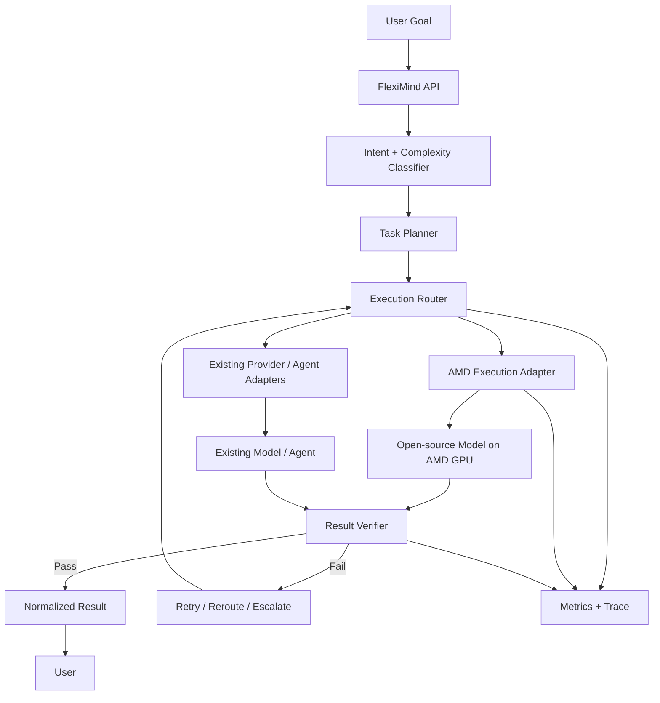

# FlexiMind — AMD AI Academy Challenge

**Team:** Bliss AI Labs  
**Challenge:** Lablab × AMD AI Academy Challenge  
**Categories:** Productivity · Developer Tools · Cloud Application  
**Status:** Challenge scaffold / AMD execution path in development

## Overview

FlexiMind is an AI workflow orchestration platform designed to turn a user's goal into an executed, verified result without requiring the user to manually choose models, engineer complex prompts, or coordinate multiple AI tools.

The broader FlexiMind product already has a private multi-agent foundation. This public repository is intentionally scoped to the **challenge-specific implementation, documentation, evaluation, and demo assets** for the Lablab × AMD AI Academy Challenge.

The challenge extension will add an AMD-backed execution path so selected open-source model workloads can run on AMD GPU infrastructure and participate in FlexiMind's routing, execution, verification, and fallback flow.

> **Accuracy note:** AMD/ROCm functionality is listed as **planned** until a reproducible implementation and benchmark are committed to this repository. This repository will not claim an AMD technology as implemented before it is verifiable.

---

## Problem

Advanced AI tools are powerful, but users still face unnecessary complexity:

- choosing between models and providers;
- deciding which tool or agent is best for a task;
- breaking a goal into smaller executable steps;
- coordinating multiple agents;
- handling failed or low-quality outputs;
- managing latency, cost, and context;
- combining results into one coherent deliverable.

For many users and small teams, the orchestration work is harder than the task itself.

## Solution

FlexiMind treats the **user's intended outcome** as the primary input.

A typical workflow is:

1. **Understand** the user's goal.
2. **Classify** the task and estimate complexity.
3. **Plan** the work as one or more subtasks.
4. **Route** each subtask to the best available execution engine.
5. **Execute** through an AI model, agent, or tool.
6. **Verify** the result against task requirements.
7. **Retry, reroute, or escalate** when quality is insufficient.
8. **Return** one normalized final result to the user.
9. **Record** execution metadata for observability and evaluation.

---

## Challenge Architecture



### AMD Challenge Path — Target

The challenge-specific path is intended to become:

**User goal → FlexiMind planner → execution router → AMD-hosted open-source model → verifier → final result**

The initial implementation will focus on one narrow, reproducible workflow before expanding to more agents and models.

---

## Current Foundation

The private FlexiMind product already provides a practical foundation for the challenge, including:

- multi-agent orchestration;
- intent-based routing;
- model/agent fallback logic;
- task execution APIs;
- frontend dashboard;
- Node.js + TypeScript backend;
- React + Vite frontend;
- Redis-backed caching / coordination;
- Prisma-based persistence;
- real-time updates through Socket.IO;
- cost-control and execution guardrails;
- containerized development components.

The public challenge repository will contain only the code and configuration needed to understand and reproduce the AMD challenge work.

---

## Technology Status

| Technology | Status | Purpose |
|---|---|---|
| Node.js / TypeScript | Existing | API and orchestration backend |
| React / Vite | Existing | User interface |
| Redis | Existing | Cache, coordination, queues / realtime support |
| Prisma | Existing | Persistence layer |
| OpenAI integration | Existing | Current model/provider integration |
| Multi-agent routing | Existing | Task classification and execution selection |
| AMD GPU execution | Planned | Challenge-specific open-source model execution |
| ROCm | Planned | AMD software stack for the challenge workload |
| Open-source model on AMD | Planned | First AMD-backed execution engine |
| Evaluation harness | Planned | Latency, quality, retry, and routing measurements |

---

## Challenge Goals

The first competition milestone is deliberately narrow:

- [ ] provision an AMD-compatible GPU environment;
- [ ] run one open-source model workload successfully;
- [ ] expose it behind a clean adapter/interface;
- [ ] connect the adapter to FlexiMind routing;
- [ ] verify and normalize the model result;
- [ ] record latency and execution metadata;
- [ ] compare at least one representative workflow;
- [ ] document setup so a reviewer can reproduce the path;
- [ ] record a short working demo.

See [AMD Integration Plan](docs/AMD_INTEGRATION_PLAN.md) and [Evaluation Plan](docs/EVALUATION_PLAN.md).

---

## Repository Structure

```text
.
├── README.md
├── CHANGELOG.md
├── SECURITY.md
├── .gitignore
├── assets/
│   └── README.md
├── benchmarks/
│   └── README.md
├── docs/
│   ├── AMD_INTEGRATION_PLAN.md
│   ├── ARCHITECTURE.md
│   ├── DEMO_PLAN.md
│   ├── EVALUATION_PLAN.md
│   ├── PROJECT_STATUS.md
│   ├── PUBLIC_REPO_POLICY.md
│   ├── ROADMAP.md
│   ├── SUBMISSION_CHECKLIST.md
│   ├── SUBMISSION_NOTES.md
│   └── TECH_STACK.md
└── src/
    └── README.md
```

---

## Development Principle

The competition repository follows one rule:

> **Only claim what can be demonstrated.**

Planned technologies remain marked as planned until the implementation, setup instructions, evidence, and results are committed.

---

## Demo Target

The first demo should show one complete path:

1. user submits a real task;
2. FlexiMind classifies and plans it;
3. the router selects the AMD execution path;
4. an open-source model runs on AMD infrastructure;
5. FlexiMind verifies the result;
6. the UI returns the final response;
7. execution metadata shows which route ran and how long it took.

See [Demo Plan](docs/DEMO_PLAN.md).

---

## Project Status

Current status is maintained in [docs/PROJECT_STATUS.md](docs/PROJECT_STATUS.md).

This repository is a challenge-specific public evaluation repository. The broader commercial FlexiMind codebase remains private.
