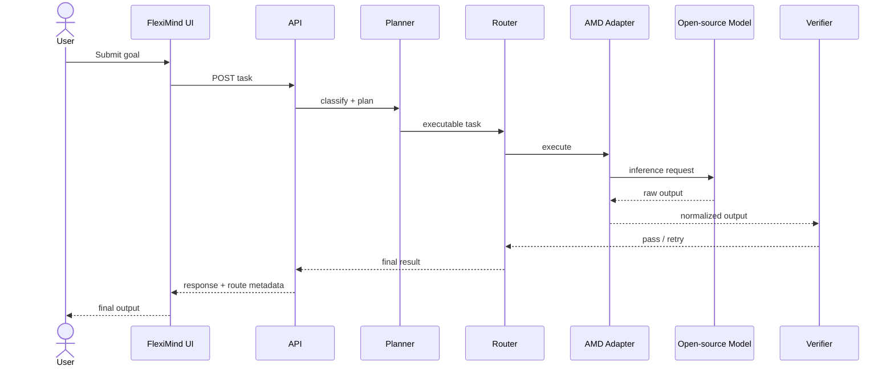

# Architecture

## 1. Architectural Objective

FlexiMind separates **goal understanding**, **planning**, **routing**, **execution**, and **verification** so that the model/provider layer can change without changing the product experience.

The AMD challenge work should therefore be implemented as a new execution adapter rather than as a separate application.

## 2. Logical Components

### 2.1 User / API Layer
Receives a user goal, request metadata, and optional constraints.

Responsibilities:
- validate input;
- establish task identity;
- enforce limits;
- pass the task into orchestration.

### 2.2 Intent and Complexity Classification
Determines the broad task family and estimated difficulty.

Example classes:
- reasoning / analysis;
- coding / development;
- workflow / operations;
- structured extraction;
- general assistance;
- mixed multi-step task.

### 2.3 Task Planner
Produces one task or a sequence/graph of subtasks.

The first AMD milestone does **not** require a complex distributed planner. A deterministic or model-assisted plan is acceptable if it is measurable and reproducible.

### 2.4 Execution Router
Chooses the execution backend.

Routing signals may include:
- task class;
- complexity;
- model capability;
- availability;
- expected latency;
- cost;
- previous failure;
- user constraint;
- AMD challenge experiment flag.

### 2.5 Execution Adapters

The adapter boundary is critical. Each backend should expose a normalized interface such as:

```ts
interface ExecutionAdapter {
  id: string;
  isAvailable(): Promise<boolean>;
  execute(input: ExecutionRequest): Promise<ExecutionResult>;
}
```

The AMD implementation should conform to the same contract as existing adapters.

### 2.6 AMD Execution Adapter — Planned

Responsibilities:
- connect to the selected AMD-hosted inference environment;
- submit model input;
- capture model/runtime metadata;
- map the raw response into `ExecutionResult`;
- surface errors cleanly;
- expose health/availability;
- support benchmark instrumentation.

No AMD implementation should be described as complete until this adapter is committed and reproducible.

### 2.7 Verification Layer
Evaluates whether the output satisfies the task contract.

Possible checks:
- required sections present;
- valid JSON/schema;
- non-empty output;
- task-specific rubric;
- deterministic assertions;
- lightweight secondary evaluation.

If verification fails, the orchestrator may:
- retry the same route;
- modify parameters;
- route to a different model;
- escalate to a stronger backend;
- return a controlled failure.

### 2.8 Observability
Each execution should eventually capture:

```text
task_id
route
model
runtime
start_time
end_time
latency_ms
input_tokens (if available)
output_tokens (if available)
retry_count
verification_status
error_code
```

These metrics feed the challenge benchmark and demo evidence.

## 3. Target Sequence



## 4. Security Boundaries

The public repository must never contain:
- production API keys;
- production database URLs;
- JWT secrets;
- Stripe secrets;
- SMTP credentials;
- private SSH keys;
- private customer data;
- database dumps;
- commercial backups.

See [PUBLIC_REPO_POLICY.md](PUBLIC_REPO_POLICY.md).
